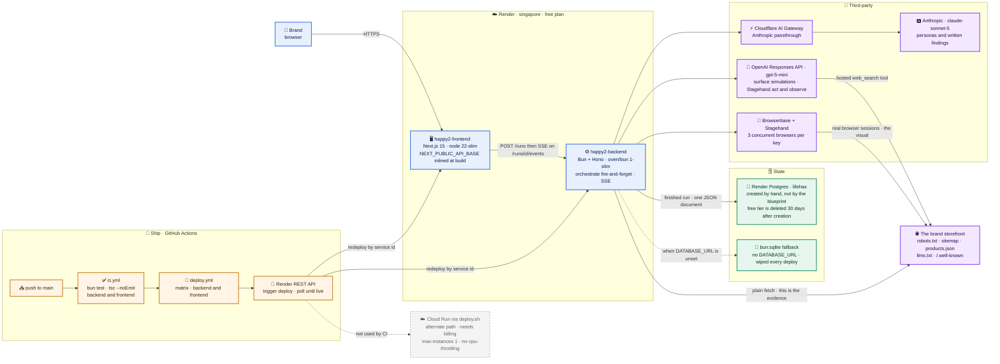
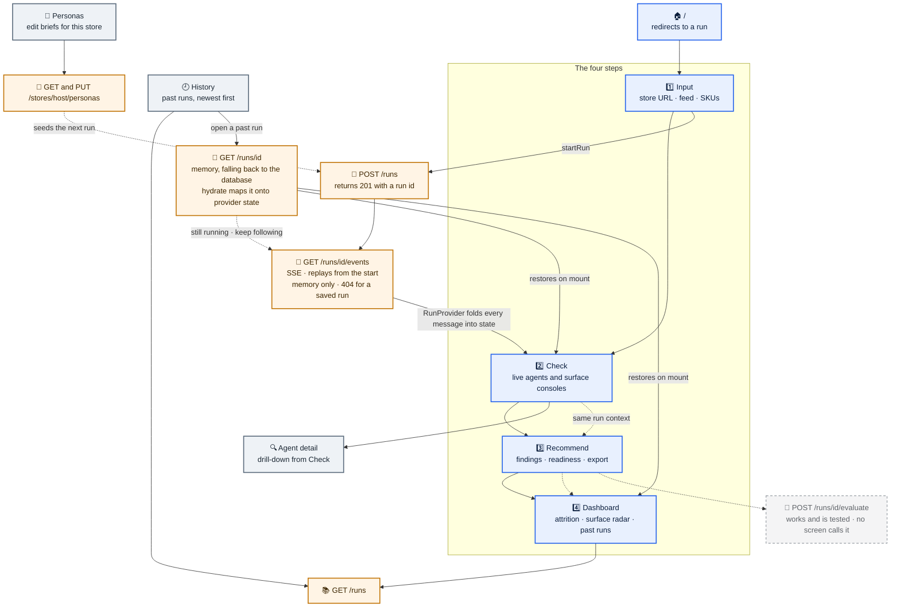
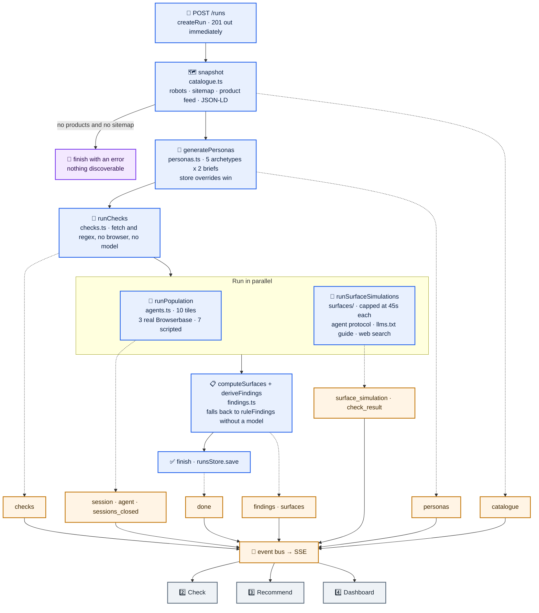

# Diagrams

Two pictures of Happy2 as it actually runs, drawn from the code rather than
from intent. `docs/architecture.md` explains *why* the pieces are shaped this
way; this file shows *where they are*.

Everything here was checked against `backend/src/index.ts`, `render.yaml`,
`.github/workflows/`, and the frontend routes. Where the running system differs
from the design, the diagram shows the running system.

**Legend.** Solid boxes run today. Dashed grey boxes exist in the repo but are
not reached from `index.ts` — see [Dark code](#dark-code). Dashed edges are
conditional or alternate paths.

---

## 1 · System and deployment



### Things worth knowing that the boxes cannot say

- **`NEXT_PUBLIC_API_BASE` is baked into the frontend image.** Next inlines it
  into the client bundle at build time, so changing the backend URL means
  rebuilding the frontend, not editing a variable.
- **Both images build from the repo root**, because `backend/` and `frontend/`
  both import `shared/` through tsconfig path aliases.
- **Render's GitHub App is not installed on this repo.** `deploy.yml` drives
  Render's REST API by service id instead, which redeploys existing services
  but provisions nothing — the Postgres instance is dashboard state, not repo
  state, even though `render.yaml` declares it.
- **A free Render Postgres is deleted 30 days after creation.** It is the only
  hard deadline on this deployment.
- **Evidence comes from `fetch`, never from a browser session.** The browsers
  are the visual; `checks.ts` is the measurement. That split is what keeps hard
  rule 5 in `AGENTS.md` honest.

---

## 2 · Feature graph

### The journey

Four numbered steps plus two side sections. The step is read off the route
segment, so a URL is always enough to restore the view.



### What a run actually does

`POST /runs` returns immediately and `orchestrate()` continues in the
background. Every stage publishes to the run's event bus, and the SSE stream is
the only way the frontend learns anything.



**Which message feeds which screen.**

| Message | Consumed by |
| --- | --- |
| `catalogue` | Check — product count |
| `personas` | Personas, Check — the briefs and tile labels |
| `checks` | Check — the audit column |
| `session`, `agent`, `sessions_closed` | Check tiles, Agent detail, Dashboard attrition |
| `surface_simulation` | Check — the three dark consoles |
| `check_result` | Check — the disclosable consolidated report |
| `findings`, `surfaces` | Recommend, Dashboard surface radar |
| `done` | every screen — stops the clock |

The stream is idempotent in both directions: the backend replays everything
that already happened when you connect, and `appendSurfaceEvent` de-duplicates
by `event_id` on the client, so a refresh mid-run loses nothing.

**A finished run is restored, not replayed.** `GET /runs/:id/events` answers
from the in-memory store alone and 404s for anything that has been saved, so
opening a past run goes through `GET /runs/:id` and `hydrate()` — one document
mapped onto provider state in a single step. If the run turns out to still be
in flight, the provider subscribes to the stream as well rather than freezing
it at the moment it was read.

---

## Dark code

Measured by an import walk from `backend/src/index.ts`, not from memory:
**56 of 66 non-test modules are reachable**. The ten that are not, totalling
815 lines:

```text
agents/cloudflare.ts        agents/native-client.ts
agents/native-search.ts     agents/shared-search.ts
env.ts                      fixtures.ts
models/anthropic.ts         runs/orchestrator.ts
runs/queue.ts               runs/services.ts
```

This is the residue of the older "two of everything" split. The surfaces work
pulled `catalogue/`, `audit/`, `score/`, `personas/generate.ts` and the
`evaluate/` rules into the live path, which is why the list is now short. What
remains is a second agent stack — `runs/orchestrator.ts` and the
Cloudflare/native shopper clients — plus two config modules the flat files
duplicate.

Two more things run but are not what they look like:

- **Seven of the ten Check tiles are scripted.** Only three get real
  Browserbase sessions, because the free tier allows three concurrent browsers
  per key. Their failure reasons come from the real audit, so nothing untrue is
  printed, but their pass/fail pattern is not a measurement.
- **`POST /runs/:id/evaluate` is reachable by `curl` only.** No screen calls it.

To re-measure the reachable set, walk the imports from `index.ts` rather than
trusting this section — it moves every time someone pushes.
